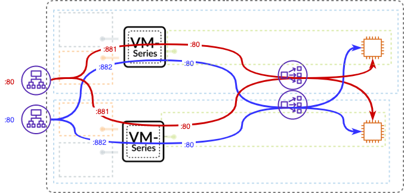

# Using VM-Series Firewalls and an ALB Sandwich in AWS

Customers are looking for different ways to ensure inbound high availability and scale for their AWS deployments. Several options exist including traditional two device HA in active passive mode, or Auto Scaling the VM-Series.

This ALB sandwich CloudFormation Template deploys a pair of VM-Series Firewalls and 2 Web Servers with an external Application Load Balancer and either an internal Application Load Balancer or Network Load Balancer depending on which CFT is chosen. 
The ALB sandwich with the VM-Series is an elegant and simplified way to manually scale VM-Series deployments to address planned or projected traffic increases while also delivering multi-Availability Zone HA. 

* Manual scale: the ALB sandwich allows you to add, via script, or manual process, additional VM-Series firewalls can be added to the deployment to address planned/projected inbound traffic increases.
* Multi-availability zone high availability: two VM-Series firewalls deployed in separate Availability Zones with traffic being distributed by the AWS load balancers enables a cloud-centric approach to resiliency and availability. 

The ALB sandwich is dependent on PAN-OS 8.1 as it uses the new FQDN object for NAT rules to automatically update the IP addresses. 

Instructions

0. Create the Bootstrap bucket place the Bootstrap.xml and init-cfg.txt files into the Config folder.
	* [Creating the Bootstrap Bucket](https://docs.paloaltonetworks.com/vm-series/9-1/vm-series-deployment/bootstrap-the-vm-series-firewall/bootstrap-the-vm-series-firewall-in-aws)
1. Deploy the CFT
2. Launch a Jumpbox into either NATGateway Subnet.
3. Access the Jumpbox to gain access to the Firewall GUIs.
	* Username/Password - pandemo/demopassword
	* The CFT creates a sgJumpbox Security Group for use allowing ports 22 and 3389.
4. Update the "lb-fqdn1" object with the FQDN of the Internal ALB available on the Outputs of the CFT.
	* Update "lb-fqdn2" for the dual app model
5. Test access to the External ALB FQDN(s).

#API commands to update the necessary objects
___
Get API Key

`
curl -X GET 'https://#Firewall Management IP#/api/?type=keygen&user=pandemo&password=demopassword' -k
`
___
API key for pandemo.  Replace in the following curl commands if different.
`
LUFRPT1Zd2pYUGpkMUNrVEZlb3hROEQyUm95dXNGRkU9N0d4RGpTN2VZaVZYMVVoS253U0p6dlk3MkM0SDFySEh2UUR4Y3hzK2g3ST0=
`
___
## API Call Examples

lb-fqdn1

`curl -kg -X GET 'https://#Firewall Management IP#/api/?key=LUFRPT1Zd2pYUGpkMUNrVEZlb3hROEQyUm95dXNGRkU9N0d4RGpTN2VZaVZYMVVoS253U0p6dlk3MkM0SDFySEh2UUR4Y3hzK2g3ST0=&type=config&action=set&xpath=/config/devices/entry/vsys/entry/address/entry[@name="lb-fqdn1"]&element=<fqdn>#Internal ALB FQDN#</fqdn>'
`
____
lb-fqdn2

`curl -kg -X GET 'https://#Firewall Management IP#/api/?key=LUFRPT1Zd2pYUGpkMUNrVEZlb3hROEQyUm95dXNGRkU9N0d4RGpTN2VZaVZYMVVoS253U0p6dlk3MkM0SDFySEh2UUR4Y3hzK2g3ST0=&type=config&action=set&xpath=/config/devices/entry/vsys/entry/address/entry[@name="lb-fqdn2"]&element=<fqdn>#Internal ALB FQDN#</fqdn>'
`	
____
Commit

`
curl -kg -X GET 'https://#Firewall Management IP#/api/?type=commit&cmd=<commit></commit>&key=LUFRPT1Zd2pYUGpkMUNrVEZlb3hROEQyUm95dXNGRkU9N0d4RGpTN2VZaVZYMVVoS253U0p6dlk3MkM0SDFySEh2UUR4Y3hzK2g3ST0='
`

**Documentation**
* Release Notes: Included in this repository.
* About the [VM-Series Firewall for AWS](https://aws.paloaltonetworks.com)
* More cloud templates are available at: http://live.paloaltonetworks.com/cloudtemplate

